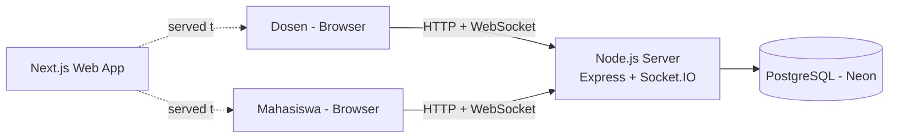

# Architecture (v1)

## Gambaran Umum


- **web/** : Next.js + TypeScript + Tailwind (UI dosen dan mahasiswa).
- **server/** : Node.js + Express + Socket.IO (REST untuk login/buat room, WebSocket untuk event real-time).
- **Database**: PostgreSQL di Neon, diakses lewat Prisma (ORM yang ramah pemula).
- Server dipisah dari Next.js karena hosting serverless (misalnya Vercel) tidak mendukung koneksi WebSocket yang terus terbuka. Server real-time di-deploy terpisah (Render/Railway).

## Struktur Repo
```
classroom-interactive-suite/
  docs/
  web/
  server/
```

## Alur Utama
1. Dosen login, membuat room, dan server membuat kode room unik.
2. Mahasiswa memasukkan kode dan nama tampilan, lalu server membuat `participant` dan memasukkannya ke "socket room" yang sesuai.
3. Setiap interaksi (reaksi, vote, pertanyaan) dikirim lewat WebSocket, disimpan ke DB, lalu di-broadcast ke seluruh isi room.
4. Dosen menerima ringkasan real-time; mahasiswa menerima hasil polling dan status room.

## Event WebSocket
| Event | Arah | Fungsi |
|---|---|---|
| `room:join` | client -> server | Bergabung ke room dengan kode |
| `room:participants` | server -> semua | Daftar peserta online terbaru |
| `room:close` | dosen -> server -> semua | Menutup room |
| `reaction:send` | mahasiswa -> server | Kirim reaksi emoji |
| `reaction:update` | server -> dosen | Ringkasan jumlah reaksi terbaru |
| `poll:launch` | dosen -> server -> semua | Meluncurkan polling |
| `poll:vote` | mahasiswa -> server | Mengirim jawaban |
| `poll:results` | server -> dosen (dan mahasiswa saat ditutup) | Statistik hasil |
| `poll:close` | dosen -> server -> semua | Menutup polling |
| `question:send` | mahasiswa -> server | Kirim pertanyaan anonim |
| `question:new` | server -> dosen | Pertanyaan baru masuk |
| `question:mark` | dosen -> server | Tandai sudah dijawab / sembunyikan |
| `picker:pick` | dosen -> server | Minta pilih mahasiswa acak |
| `picker:result` | server -> semua | Hasil pemilihan acak |

## Keputusan Penting
- **Auth v1**: hanya dosen yang punya akun. Mahasiswa masuk tanpa akun, cukup kode room dan nama tampilan.
- **Anonimitas**: `participant_id` pada pertanyaan hanya disimpan untuk rate limiting, dan tidak pernah dikirim ke client mana pun.
- **Fairness picker**: tabel `picks` mencatat siapa yang sudah terpilih, sehingga tiap mahasiswa terpilih sekali sebelum siklus diulang.
- **Satu suara per polling**: dijaga dengan unique constraint `(poll_id, participant_id)` di database.
